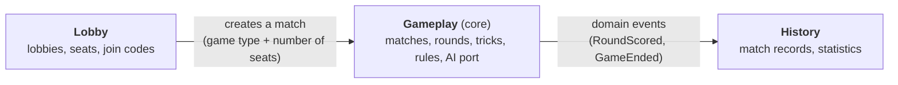
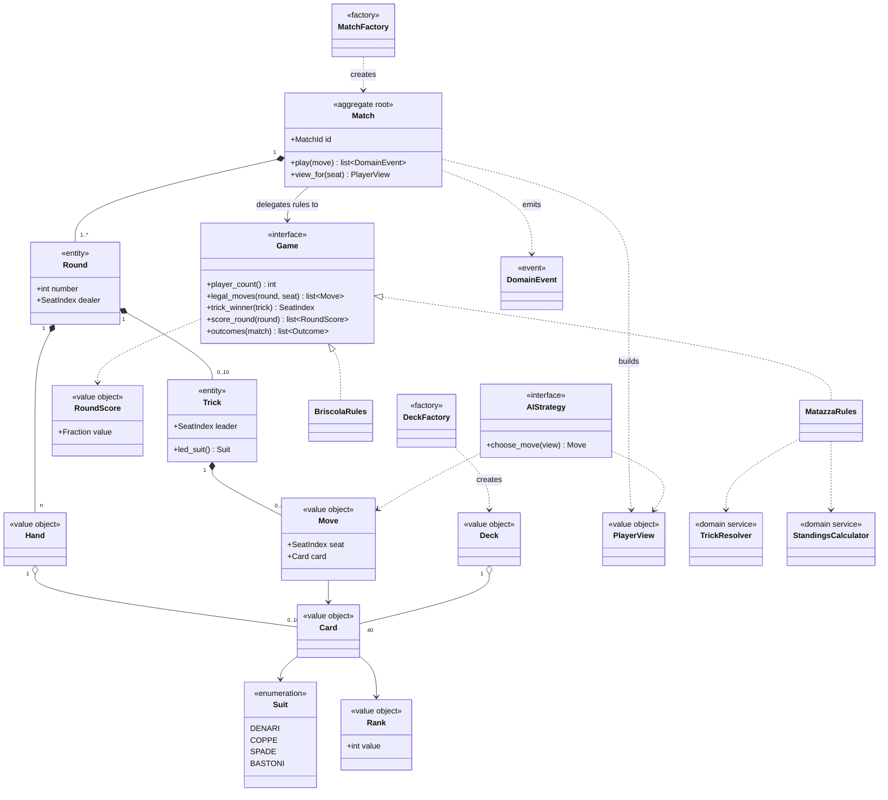
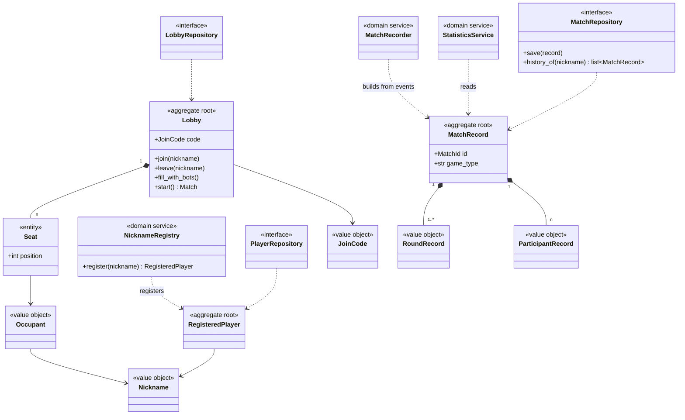

# Domain model

Domain model of **italian_card_games**: ubiquitous language, bounded contexts, DDD building blocks and class diagrams. Requirement IDs (`FR-xx`, `NFR-xx`) refer to [requirements.md](requirements.md).

## 1. Ubiquitous language

Words are used with exactly one meaning in code, tests and documents. Italian terms are kept where they are the vocabulary of the card games.

| Term | Code name | Meaning |
|---|---|---|
| Game | `Game` | A *kind* of card game with its own rules (Matazza, Briscola). |
| Match | `Match` | One play-through of a game, from the first deal until an end condition. |
| Seat | `SeatIndex` (Gameplay), `Seat` (Lobby) | A position at the table. A match has as many seats as its game requires. |
| Player | | Whoever fills a seat: a human (with a nickname) or a bot. The engine does not distinguish them. |
| Suit (seme) | `Suit` | `DENARI`, `COPPE`, `SPADE`, `BASTONI`. |
| Rank | `Rank` | A number from 1 to 10. Rank 1 is the *asso* (ace). |
| Card | `Card` | A suit and a rank. |
| Deck (mazzo) | `Deck` | The 40 distinct cards. |
| Hand | `Hand` | The cards a seat holds and has not played yet. |
| Move | `Move` | A seat playing one card. |
| Trick (presa) | `Trick` | The cards played one per seat, from a leader, until a winner takes them. |
| Leader | | The seat that plays the first card of a trick. |
| Led suit | | The suit of the first card of a trick. |
| Round | `Round` | One deal of the whole deck, played out in tricks until all hands are empty. |
| Dealer | | The seat that deals a round. It rotates each round (FR-11). |
| Round score | `RoundScore` | Points a seat gets from the cards it captured in one round. Exact fraction. |
| Standing points | `StandingPoints` | Penalty points accumulated across the rounds of a match. Reaching the limits ends the match. |
| Cursed card | | In Matazza, the 8 of spades. Its holder is relevant when standing points are awarded. |
| Solo win | | In Matazza, a round in which exactly one seat scores more than 1.0 and the others 1.0 or less. That seat wins the match. |
| Outcome | `Outcome` | `WIN` or `LOSS` for a seat at the end of a match (FR-19). |
| Player view | `PlayerView` | What one seat may see of the match: its own hand and public information (FR-06). |
| Domain event | `DomainEvent` | A fact that happened in a match (e.g. `TrickWon`). Other parts of the system react to it. |
| Lobby | `Lobby` | A waiting room where seats are filled before a match starts. |
| Join code | `JoinCode` | The code used to enter a lobby. |
| Nickname | `Nickname` | The name a human registers. It is unique and reserved. |
| Registered player | `RegisteredPlayer` | A human who has registered a nickname. Their history and statistics belong to that nickname. |
| Match record | `MatchRecord` | The persisted summary of a finished match. |
| Bot / AI strategy | `AIStrategy` | Something that chooses a move given a player view. |

"Game" is the kind of game and "match" is one play. Requirements sometimes say "game ends" to mean a match ends.

## 2. Bounded contexts

The same word means different things in different parts of the system. A player is a registered nickname in the lobby, a seat in a match, and a name with counters in the statistics. These are separate contexts, each with its own model.

| Context | Responsibility | Core? |
|---|---|---|
| **Gameplay** | Cards, matches, rounds, tricks, rules, scoring, end conditions, the `AIStrategy` port. | Yes: this is the heart of the product. |
| **Lobby** | Registering unique nicknames, creating and joining lobbies, filling seats with humans or bots, who is connected, starting a match. | Supporting |
| **History** | Persisting finished matches and computing statistics. | Supporting |

Relations between contexts:

- **Lobby uses Gameplay** through the match factory. Gameplay does not know the lobby exists.
- **History consumes Gameplay's events**. Gameplay does not know History exists.
- Contexts share only identifiers and events, never objects. Gameplay knows seats by `SeatIndex`. The mapping from seat to nickname lives in the Lobby and reaches History when the match is recorded.
- **Who produces a move is outside Gameplay.** A match only receives "seat *i* plays card *c*". Human, bot, or a bot taking over after a disconnect (FR-30) look the same to it (FR-04).

## 3. Building blocks per context

### 3.1 Gameplay

| Kind | Name | Notes |
|---|---|---|
| Value object | `Suit`, `Rank`, `Card` | Immutable. Equal when their values are equal. |
| Value object | `Deck` | Exactly 40 distinct cards (FR-02). |
| Value object | `Hand` | The unplayed cards of a seat. |
| Value object | `SeatIndex` | A number from 0 to player count minus 1. |
| Value object | `Move` | A seat and a card. |
| Value object | `RoundScore` | Exact fraction (`fractions.Fraction`), never a float (FR-12). |
| Value object | `StandingPoints` | A non-negative integer per seat. |
| Value object | `Outcome` | `WIN` or `LOSS`. |
| Value object | `PlayerView` | Own hand plus public information. Built by the match (FR-06). |
| Entity | `Round` | Identity: its number within the match. Holds the hands, the dealer and its tricks. |
| Entity | `Trick` | Identity: its position within the round. Holds the moves made. |
| **Aggregate root** | `Match` | Identity: `MatchId`. The only object outside code talks to. It enforces every rule and invariant of its rounds and tricks. |
| Domain service | `TrickResolver` | Decides the trick winner from the strength order (FR-08, FR-10). Specific to Matazza. |
| Domain service | `StandingsCalculator` | Solo win and the `numLow` rules (FR-13 to FR-17). Specific to Matazza. |
| Factory | `DeckFactory` | Builds a shuffled `Deck` from an injectable random source (FR-02, NFR-04). |
| Factory | `MatchFactory` | Builds a `Match` for a game type and a number of seats. |
| Port (interface) | `Game` | The rules of one game: player count, dealing, legal moves, trick winner, round scoring, end conditions (FR-01, FR-03). Implemented by `MatazzaRules` and `BriscolaRules`. |
| Port (interface) | `AIStrategy` | `choose_move(view) -> Move`. Implemented by the rule-based, LLM and (stretch) Prolog strategies (FR-21). |
| Domain event | `CardPlayed`, `TrickWon`, `RoundScored`, `StandingPointsAwarded`, `GameEnded` | Emitted by `Match.play`. Used for real-time updates (FR-29) and for History (FR-31). |

Design choices:

- **Immutable state, events as output.** A move produces a new state and a list of events. This gives deterministic replay (NFR-04), lets a bot try moves without side effects, and the same events feed WebSockets and History.
- **Per-game rules behind `Game`.** `Match` delegates every game-specific decision to its `Game`. Adding Briscola does not change `Match` (FR-01).

### 3.2 Lobby

| Kind | Name | Notes |
|---|---|---|
| Value object | `Nickname`, `JoinCode` | Validated on creation. |
| Value object | `Occupant` | Human (with a nickname) or bot. |
| Entity | `Seat` | Identity: its position in the lobby. Holds an occupant or is empty. |
| **Aggregate root** | `RegisteredPlayer` | Identity: its `Nickname`. Created only through the registry, so a nickname exists once (FR-26). There is no ownership check: anyone who enters a registered nickname can use it. |
| **Aggregate root** | `Lobby` | Identity: its join code. Controls joining, leaving, bot fill, and starting a match. Only registered players can join. |
| Domain service | `NicknameRegistry` | Registers a nickname, rejecting one that is already taken. Uniqueness spans all players, so it cannot live inside a single `RegisteredPlayer`. |
| Factory | `LobbyFactory` | Creates a lobby with a fresh join code from an injectable generator. |
| Repository (port) | `PlayerRepository` | Stores registered players. It must survive restarts, so the adapter is SQLite via SQLAlchemy, with a unique constraint on the nickname. |
| Repository (port) | `LobbyRepository` | Lobbies are short-lived, so an in-memory adapter is enough. |

### 3.3 History

| Kind | Name | Notes |
|---|---|---|
| Value object | `RoundRecord` | The score of each seat in one round (FR-31). |
| Value object | `ParticipantRecord` | Nickname (or bot), kind, and outcome. |
| **Aggregate root** | `MatchRecord` | Identity: the match id. Game type, participants, round records. Does not store total standing points (FR-31). |
| Domain service | `MatchRecorder` | Consumes Gameplay events and builds the `MatchRecord`. |
| Domain service | `StatisticsService` | Computes played, won and lost, per game type, from the records (FR-33). |
| Repository (port) | `MatchRepository` | Stores and reads `MatchRecord`. The adapter is SQLite via SQLAlchemy. |

## 4. Class diagrams

### 4.1 Gameplay

### 4.2 Lobby and History

## 5. Invariants and where they live

| Invariant | Enforced by | Requirement |
|---|---|---|
| A deck has exactly 40 distinct cards. | `Deck` | FR-02 |
| An illegal move is rejected and the state is unchanged. | `Match.play` using `Game.legal_moves` | FR-05, FR-09 |
| The trick winner holds the highest-strength card of the led suit. | `TrickResolver` | FR-08, FR-10 |
| The first leader is the seat after the dealer, and the dealer rotates each round. | `Match` when it starts a round | FR-11 |
| The four round scores sum to exactly 32/3. | `Game.score_round`, with `RoundScore` as a fraction | FR-12 |
| A solo win is checked before any standing points. | `StandingsCalculator` | FR-13 |
| `numLow == 3` is unreachable and raises an error. | `StandingsCalculator` | FR-17 |
| The end conditions are checked every time points are awarded. | `Match`, through `Game.outcomes` | FR-18 |
| Every seat ends with exactly one outcome, win or loss. | `Match` when it emits `GameEnded` | FR-19 |
| A player view never contains another seat's hand. | `Match.view_for` | FR-06 |
| A record keeps round scores and outcomes but not total standing points. | `MatchRecorder`, `MatchRecord` | FR-31 |
| A nickname is registered at most once. | `NicknameRegistry`, backed by a unique constraint in the database | FR-26 |
| A lobby never has more seats than its game requires. *(Derived from FR-27 and FR-28.)* | `Lobby` | FR-27, FR-28 |
| The core has no dependency on FastAPI, NiceGUI or SQLAlchemy. | Package structure | NFR-01 |

## 6. Open questions

- **Briscola.** Whether `Game` needs team support is decided at step 11. `Game.player_count` and `Game.outcomes` are meant to leave room for it.
